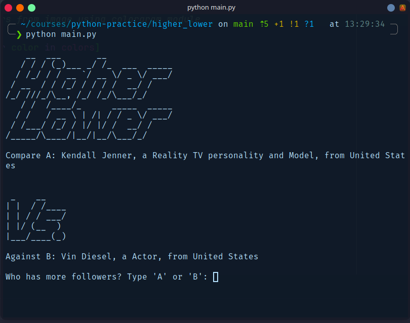
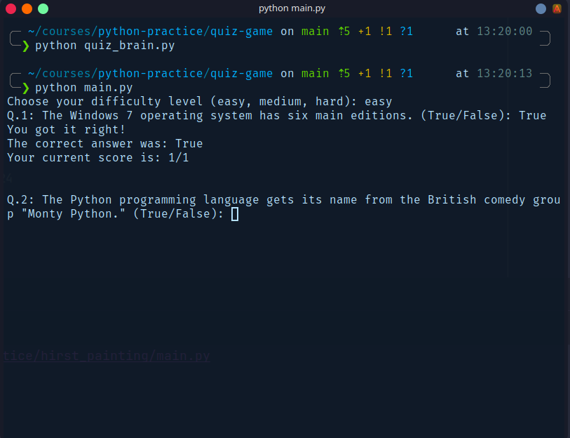
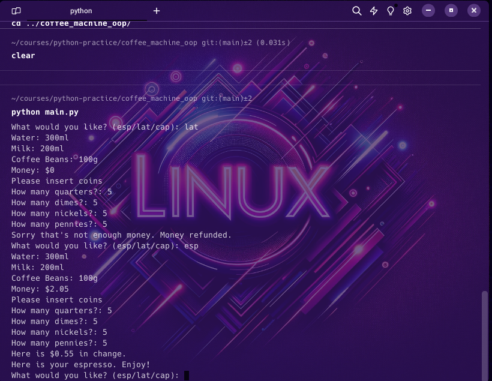
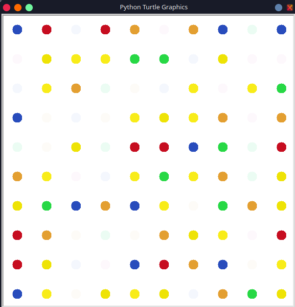
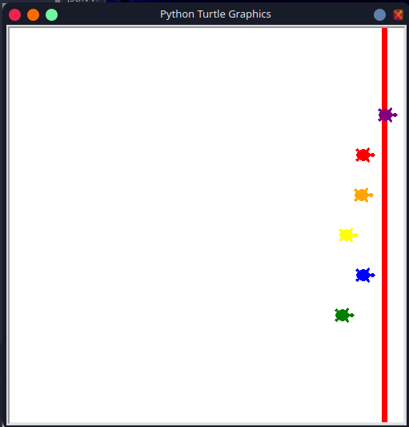
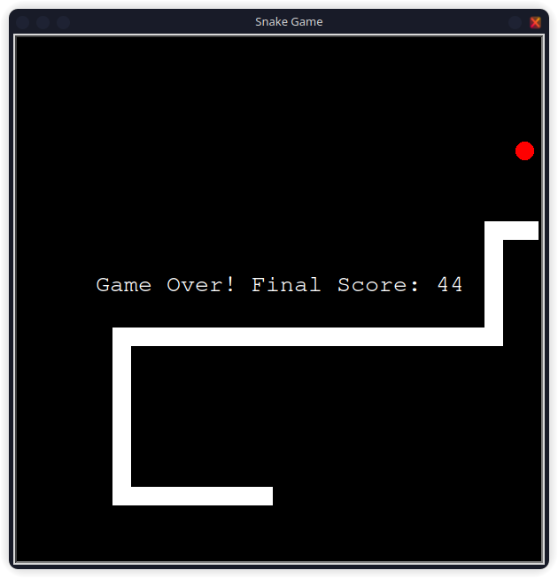
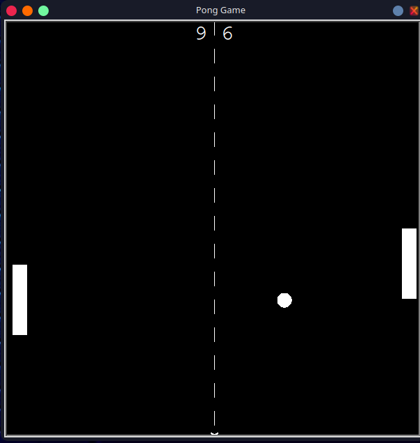

### Updated Master `README.md`

You can add the new entry for the Pong Game in your master `README.md`:

#### Updated Main `README.md`


# Python Practice Assignments

Welcome to the Python Practice Assignments repository. This repository is a collection of various Python projects, including practice assignments, games, scripts, utilities, websites, data science projects, and programs. Each project is organized into its own directory and contains all the necessary files to run and understand the project.

## Table of Contents

- [About](#about)
- [Projects](#projects)
  - [Higher Lower Game](#higher-lower-game)
  - [Coffee Machine](#coffee-machine)
  - [Quiz Game](#quiz-game)
  - [Hirst Painting](#hirst-painting)
  - [Turtle Race](#turtle-race)
  - [Snake Game](#snake-game)
  - [Pong Game](#pong-game)
  - [More Projects](#more-projects)

## About

This repository is designed to help track progress and showcase various Python projects. The projects range from simple practice assignments to more complex applications. The goal is to maintain a comprehensive collection of Python work that can be used for learning, reference, and demonstration purposes.

## Projects

### Higher Lower Game

- **Description:** A simple game where the player guesses which of two entities has more followers.
- **Files:**
  - `main.py`: The main script for the game.
  - `README.md`: Detailed information about the game.
- **Project Directory:** [Higher Lower Game](higher-lower-game/)

### Coffee Machine

- **Description:** A simulation of a coffee machine that can make espresso, latte, and cappuccino.
- **Files:**
  - `main.py`: The main script for the coffee machine simulation.
  - `menu.py`: Contains the resources used by the coffee machine.
  - `README.md`: Detailed information about the coffee machine project.
- **Project Directory:** [Coffee Machine](coffee-machine/)

### Quiz Game

- **Description:** A trivia game that fetches questions from the Open Trivia Database API based on the user's chosen difficulty level.
- **Files:**
  - `main.py`: The main script that runs the game.
  - `quiz_brain.py`: Contains the `QuizBrain` class that handles the quiz logic.
  - `question_model.py`: Contains the `Question` class that represents a quiz question.
  - `data.py`: Fetches and processes the question data from the API.
  - `README.md`: Detailed information about the quiz game project.
- **Project Directory:** [Quiz Game](quiz-game/)

### Coffee Machine

- **Description:** A simulation of a coffee machine that can make espresso, latte, and cappuccino.
- **Files:**
  - `main.py`: The main script for the coffee machine simulation.
  - `menu.py`: Contains the resources used by the coffee machine.
  - `README.md`: Detailed information about the coffee machine project.
- **Project Directory:** [Coffee Machine](coffee-machine/)

### Hirst Painting

- **Description:** Uses the Turtle graphics library to create a painting inspired by Damien Hirst.
- **Files:**
  - `main.py`: The main script that runs the painting program.
  - `hirst_painting.jpg`: The image from which colors are extracted.
  - `README.md`: Detailed information about the Hirst Painting project.
- **Project Directory:** [Hirst Painting](hirst-painting/)

### Turtle Race

- **Description:** A simple turtle race game using the Turtle graphics library.
- **Files:**
  - `main.py`: The main script that runs the turtle race.
  - `README.md`: Detailed information about the Turtle Race project.
- **Project Directory:** [Turtle Race](turtle-race/)

### Snake Game

- **Description:** A classic Snake game using the Turtle graphics library.
- **Files:**
  - `main.py`: The main script that runs the Snake game.
  - `README.md`: Detailed information about the Snake Game project.
- **Project Directory:** [Snake Game](snake-game/)

### Pong Game
### Pong Game

- **Description:** A classic Pong game using the Turtle graphics library.
- **Files:**
  - `main.py`: The main script that runs the Pong game.
  - `README.md`: Detailed information about the Pong Game project.
- **Project Directory:** [Pong Game](pong-game/)
- **Description:** A classic Pong game using the Turtle graphics library.
- **Files:**
  - `main.py`: The main script that runs the Pong game.
  - `README.md`: Detailed information about the Pong Game project.
- **Project Directory:** [Pong Game](pong-game/)

### More Projects

- As more projects are added, they will be listed here in the same format.

## Adding New Projects

When adding a new project, follow these steps:

1. **Create a New Directory:** Create a new directory under the root folder for the project.
2. **Add Project Files:** Add all necessary files (e.g., `main.py`, `README.md`).
3. **Update the README:** Add a new section under [Projects](#projects) for the new project, following the format used for previous projects.

## How to Use

To run any of the projects, navigate to the project's directory and execute the main script using Python. For example:

```bash
cd python_practice/project
python main.py
```
