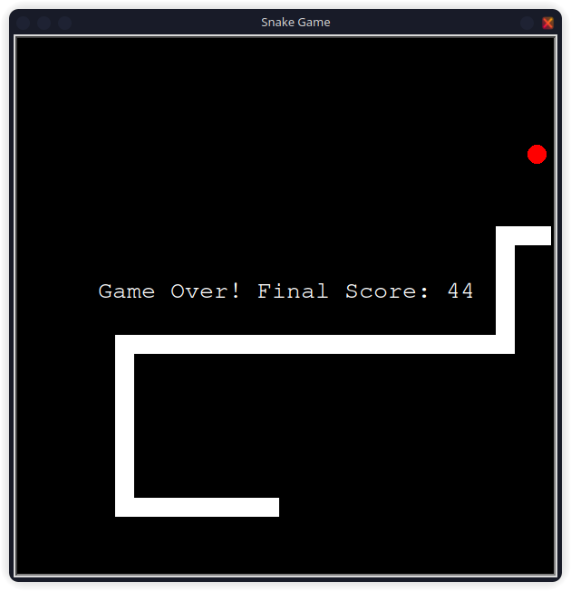

# Snake Game

## Description

The Snake Game project is a classic implementation of the Snake game using the Turtle graphics library in Python. Control the snake to eat the food and grow longer. Avoid running into walls or the snake's own body. The game keeps track of your score and allows you to play again after the game ends.

## How to Play

1. Run the `main.py` script.
2. Use the arrow keys to control the snake:
   - Up: Move up
   - Down: Move down
   - Left: Move left
   - Right: Move right
3. The game ends if the snake runs into a wall or its own body.
4. You can restart the game by typing 'yes' when prompted.

## Files

- `main.py`: The main script that runs the Snake game.

## Running the Project

To run the project, navigate to the `snake-game` directory and execute the `main.py` script using Python:

```bash
cd snake-game
python main.py
```
